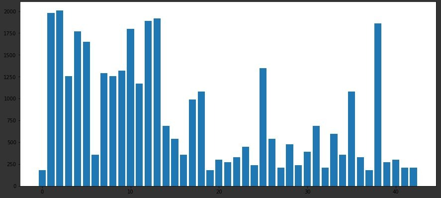

# **Traffic Sign Recognition** 

## Writeup

### You can use this file as a template for your writeup if you want to submit it as a markdown file, but feel free to use some other method and submit a pdf if you prefer.

---

**Build a Traffic Sign Recognition Project**

The goals / steps of this project are the following:
* Load the data set (see below for links to the project data set)
* Explore, summarize and visualize the data set
* Design, train and test a model architecture
* Use the model to make predictions on new images
* Analyze the softmax probabilities of the new images
* Summarize the results with a written report

[//]: # (Image References)

[image1]: ./examples/visualization.jpg "Visualization"
[image2]: ./examples/grayscale.jpg "Grayscaling"
[image3]: ./examples/random_noise.jpg "Random Noise"
[image4]: ./examples/placeholder.png "Traffic Sign 1"
[image5]: ./examples/placeholder.png "Traffic Sign 2"
[image6]: ./examples/placeholder.png "Traffic Sign 3"
[image7]: ./examples/placeholder.png "Traffic Sign 4"
[image8]: ./examples/placeholder.png "Traffic Sign 5"

## Rubric Points

### Data Set Summary & Exploration

#### 1. Provide a basic summary of the data set. In the code, the analysis should be done using python, numpy and/or pandas methods rather than hardcoding results manually.

I used the numpy library to calculate summary statistics of the traffic
signs data set:

* The size of training set is 34799
* The size of the validation set is 12630
* The size of test set is 12630
* The shape of a traffic sign image is 1024
* The number of unique classes/labels in the data set is 43

#### 2. Include an exploratory visualization of the dataset.

Here is an exploratory visualization of the data set. It is a bar chart showing how the data ...

 

### Design and Test a Model Architecture

#### 1. Describe how you preprocessed the image data. What techniques were chosen and why did you choose these techniques? Consider including images showing the output of each preprocessing technique. Pre-processing refers to techniques such as converting to grayscale, normalization, etc. (OPTIONAL: As described in the "Stand Out Suggestions" part of the rubric, if you generated additional data for training, describe why you decided to generate additional data, how you generated the data, and provide example images of the additional data. Then describe the characteristics of the augmented training set like number of images in the set, number of images for each class, etc.)

The Design of the Model Architecture:

*Pre-process the Data Set to make easily analyzed. I used a very simple techniques to avoid over doing and have a solid understanding for t    them 

   1. convert form RGB image to gray to have a clearier image.
   2. Normilized the image to a range [0.1,0.9] to be well conditioned

Note:
    The date for training had a huge lack of variaty considering certain output classes which cause some classes to be dedicted worse than the rest. we could avoid that by taking the same number of samples per class but that would reduce the training set significantly or we could add more data.

#### 2. Describe what your final model architecture looks like including model type, layers, layer sizes, connectivity, etc.) Consider including a diagram and/or table describing the final model.

My final model was Lenet 5 consisted of the following layers:

| Layer         		|     Description	        					| 
|:---------------------:|:---------------------------------------------:| 
| Input         		| 32x32x1 Gray image   							| 
| Convolution 5x5     	| 1x1 stride, padding 'Valid', outputs 28x28x6 	|
| RELU					|												|
| Max pooling	      	| 2x2 stride,  outputs 14x14x6 			     	|
| Convolution 5x5     	| 1x1 stride, padding 'Valid', outputs 10x10x16 |
| RELU					|												|
| Max pooling			| 2x2 stride,  outputs 5x5x16 			     	|
| Flatten				| 												|
| Fully Connected		|Input 400, Output 120  						|
| RELU					|												|
| DropOut				|prob:0.5   									|
| Fully Connected		|Input 120, Output 84  							|
| RELU					|												|
| DropOut				|prob:0.5   									|
| Fully Connected		|Input 84, Output 43  							|
| Softmax				|												|
| Optmizer				|Adam algorithm 								|
|						|												|
 

#### 3. Describe how you trained your model. The discussion can include the type of optimizer, the batch size, number of epochs and any hyperparameters such as learning rate.

To train the model, I divided the data set into batches and trained the model on all batches till i finished the data set then repeated the all the batches epochs times.
I used the following hyperparameters:
    *optimizer = Adam algorithm
    *learning rate = 0.001
    *EPOCHS = 200
    *BATCH_SIZE = 5000

#### 4. Describe the approach taken for finding a solution and getting the validation set accuracy to be at least 0.93. Include in the discussion the results on the training, validation and test sets and where in the code these were calculated. Your approach may have been an iterative process, in which case, outline the steps you took to get to the final solution and why you chose those steps. Perhaps your solution involved an already well known implementation or architecture. In this case, discuss why you think the architecture is suitable for the current problem.

My final model results were:
* training set accuracy of 0.988
* validation set accuracy of 0.932 
* test set accuracy of 0.905

I chosed an iterative approach. I have chosen lenet5 architecture but it never reached the level of accruracy over 90 percent so i add a dropout layer to make it more robust to changes and give better performance. I may have an overfitting case and i will need to adjust the model architecture further to overcome this issue.
I tunned three parameter the learning rate, epochs and batch size. I stoped tuning the Learning rate when the parameter was causing exponential improvement in accuracy. I increase batch size a much as i can to be able to full utilize this parameter and kept increasing the learning rate till i reached the targeted accuracy. convolution layer worked perfectly with this kind of problems due to the idea of collection the pixels into groups which create a sense of objects in image and make it faster than traditional techniques.

 

### Test a Model on New Images

#### 1. Choose five German traffic signs found on the web and provide them in the report. For each image, discuss what quality or qualities might be difficult to classify.

Here are five German traffic signs that I found on the web:

.jpg')
.jpg')
.jpg')
.jpg')
.jpg')
The first image might be difficult to classify because ...

#### 2. Discuss the model's predictions on these new traffic signs and compare the results to predicting on the test set. At a minimum, discuss what the predictions were, the accuracy on these new predictions, and compare the accuracy to the accuracy on the test set (OPTIONAL: Discuss the results in more detail as described in the "Stand Out Suggestions" part of the rubric).

Here are the results of the prediction:

| Image 			    |Prediction 									| 
|:---------------------:|:---------------------------------------------:| 
| Stop Sign     		| Stop sign   									| 
| Childern crossing 	| General caution								|
| Keep Right			| Keep Right									|
| 30 km/h   			| 30 km/h   					 				|
| roundabout			| no passing for vehicles ove 3.5 metric tons	|

The model was able to correctly guess 4 of the 5 traffic signs, which gives an accuracy of 60%. This compares favorably to the accuracy on the test set of 90% which is way off so we need to improve or data set and model architecture.

#### 3. Describe how certain the model is when predicting on each of the five new images by looking at the softmax probabilities for each prediction. Provide the top 5 softmax probabilities for each image along with the sign type of each probability. (OPTIONAL: as described in the "Stand Out Suggestions" part of the rubric, visualizations can also be provided such as bar charts)

For the first image, the model is not sure that this is a 30km/h sign (probability of 0.21), and the image does contain a 30km/h sign. The top five soft max probabilities were

| Probability         	|     Prediction	        					| 
|:---------------------:|:---------------------------------------------:| 
| .21         			| 30km/h   									| 
| .16     				| 50km/h 										|
| .09					| Wild animal road								|
| .07	      			| 70km/h    					 				|
| .07				    | 120km/h           							|

For the second image, the model is pretty sure that this is a Keep right sign (probability of 0.79), and the image does contain a keep right sign. The top five soft max probabilities were

| Probability         	|     Prediction	        					| 
|:---------------------:|:---------------------------------------------:| 
| .79         			| Keep right   									| 
| .32     				| End of all speed 								|
| .17					| general caution								|
| .15	      			| stop      					 				|
| .10				    | 80km/h            							|

For the thid image, the model is sure that this is a general caution sign (probability of 0.08), and the image does contain a Childen crossing sign. The top five soft max probabilities were

| Probability         	|     Prediction	        					| 
|:---------------------:|:---------------------------------------------:| 
| .08         			| general caution   							| 
| .06     				| keep right 				    				|
| .03					| pedistrians					    			|
| .03	      			| traffic signals     			 				|
| .02				    | bumpy road           							|

For the forth image, the model is sure that this is a no passing for vehicles ove 3.5 metric tons sign (probability of 0.13), and the image does contain a Roundabout sign. The top five soft max probabilities were

| Probability         	|     Prediction	        					| 
|:---------------------:|:---------------------------------------------:| 
| .13         			| no passing for vehicles ove 3.5 metric tons   |  
| .12     				| slippery road     							|
| .11					| no passing							    	|
| .10	      			| roundabout      					 			|
| .10				    | priority            							|

For the fifth image, the model is sure that this is a stop sign (probability of 0.08), and the image does contain a stop sign. The top five soft max probabilities were

| Probability         	|     Prediction	        					| 
|:---------------------:|:---------------------------------------------:| 
| .08         			| stop      									| 
| .04     				| priority road 								|
| .04					| keep right    								|
| .04	      			| no vehicle   					 				|
| .03				    | yeild              							|
